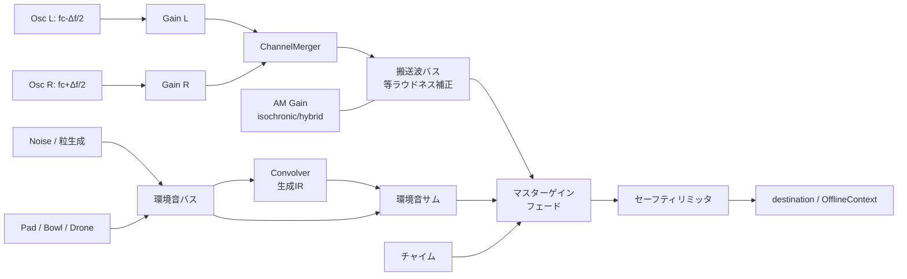

# Binaural Studio — 仕様書 v1.0

集中（ポモドーロ）と瞑想のためのバイノーラルビート生成アプリ。
Web アプリ / PWA、音は全てブラウザ内で合成し、音源ファイルを一切持たない。
リアルタイム再生と 25 分 WAV 書き出しの両方に対応する。

---

## 1. 目的とスコープ

| | 内容 |
|---|---|
| 主用途 A | 仕事中の集中（25 分ポモドーロ × 休憩サイクル） |
| 主用途 B | 仕事後の瞑想・リラックス（クールダウン、入眠前） |
| 形態 | Web アプリ（PWA、オフライン動作、インストール可） |
| 音の作り方 | Web Audio API で完全合成（サンプル素材ゼロ、リポジトリに音声ファイルを置かない） |
| 出力 | ①ブラウザでリアルタイム再生 ②WAV 書き出し（他デバイス・オフライン再生用） |
| バックエンド | なし。全データはローカル（localStorage / IndexedDB） |
| 対象ブラウザ | Chrome / Edge / Safari の最新 2 系統（デスクトップ + iOS/Android） |

**非スコープ**：アカウント、クラウド同期、SNS 共有、EEG デバイス連携、音楽（メロディ）生成、医療・診断用途。

### 効果についての立場

バイノーラルビートによる脳波同調（entrainment）の研究結果は一貫しておらず、効果量も小さい報告が多い。本アプリは「気分と集中の切り替えスイッチとして機能する、音として気持ちいい環境音ツール」として設計する。UI 上でも治療効果を主張せず、§14 の注意事項を必ず表示する。設計努力は主に**音質・可聴性・時間設計・使い心地**に投じる。

---

## 2. 設計原則

1. **位相の純度を守る** — L/R チャンネルはビート知覚に必要な位相差を持つ。搬送波バスは、チャンネルを混ぜる処理（リバーブ、モノダウンミックス、M/S 処理、ステレオワイドナー）を一切通さない。
2. **クリックを鳴らさない** — 全てのゲイン・周波数変化はランプで行う。区間の切り替えは AudioParam のスケジューリングで表現し、ノードの生成・破棄で表現しない。
3. **時間はオーディオクロックが正義** — タイマーは `AudioContext.currentTime` を唯一の時間源とする。`setInterval` は表示更新のみ。
4. **ラウドネスを揃える** — 搬送波の周波数が変わっても体感音量が変わらないよう等ラウドネス補正を掛ける。プリセット間の音量差は 1.5 LU 以内。
5. **静けさを守る** — 起動音なし、通知なし、アニメーションは 0.2 Hz 以下のゆるやかな変化のみ（点滅を作らない）。
6. **オフラインで完結** — 外部フォント・CDN・API を使わない。

---

## 3. 音響設計

### 3.1 バイノーラルコア

搬送波中心周波数 `fc`、ビート周波数 `Δf` に対し

```
left  = sin(2π (fc − Δf/2) t)
right = sin(2π (fc + Δf/2) t)
```

- `OscillatorNode` 2 基（type: `sine`）→ 各々 `GainNode` → `ChannelMergerNode`（入力 0=L, 1=R）→ 搬送波バス。
- **左右を独立ノードで作り、`ChannelMergerNode` 以降で決してモノにしない。**
- 周波数変更は `cancelScheduledValues` → `setValueAtTime(現在値)` → `linearRampToValueAtTime` の 3 点セットで行う（位相は連続、Web Audio は周波数変更で位相をリセットしない）。
- 既定レベル：各チャンネル −30 dBFS（等ラウドネス補正前）。搬送波は「聞こえるが主役ではない」音量に置き、環境音レイヤーで純音の耳障りさを覆う。

#### 搬送波の選定

ビート知覚は搬送波 200–500 Hz 付近で最も明瞭で、1000 Hz を超えると急速に弱まる（Oster 1973 以来の一般的知見）。またビートレートが 30 Hz を超えると「うなり」として知覚されにくい。これを踏まえた既定値：

| 帯域 | Δf 範囲 | 既定 Δf | 既定 fc | 備考 |
|---|---|---|---|---|
| Delta | 0.5–4 Hz | 2.0 Hz | 160 Hz | 深い休息・入眠前。イヤホンの低域再生能力に依存 |
| Theta | 4–8 Hz | 6.0 Hz | 200 Hz | 瞑想・内省。Schumann 7.83 Hz プリセットを含む |
| Alpha | 8–12 Hz | 10.0 Hz | 240 Hz | リラックスした覚醒・読書 |
| SMR | 12–15 Hz | 14.0 Hz | 280 Hz | 静かな集中。長時間作業向き |
| Beta | 15–24 Hz | 16.0 Hz | 320 Hz | 能動的な集中・処理速度 |
| Gamma | 35–45 Hz | 40.0 Hz | 400 Hz | **純バイノーラルでは知覚が弱い帯域**。§3.2 のアイソクロニック方式を既定にする |

- ユーザーは `fc` を 80–600 Hz、`Δf` を 0.5–45 Hz の範囲で自由に設定できる（Studio 画面）。
- `fc − Δf/2 < 40 Hz` になる組み合わせは UI 側で禁止する。

#### 等ラウドネス補正

低い搬送波は同じ振幅でも小さく聞こえる。ISO 226（40 phon）を近似した補正テーブルを持ち、`fc` から線形補間したゲインを掛ける（400 Hz を 0 dB 基準）。

| fc (Hz) | 80 | 120 | 160 | 200 | 250 | 315 | 400 | 500 | 600 |
|---|---|---|---|---|---|---|---|---|---|
| 補正 (dB) | +13.0 | +9.5 | +7.0 | +5.0 | +3.0 | +1.5 | 0.0 | −0.5 | −1.0 |

実測で微調整する前提の初期値。テストで単調減少であることを検証する（§13）。

### 3.2 スピーカー / 低知覚帯域向けフォールバック

真のバイノーラルビートはヘッドホン必須。以下の代替モードを持つ。

| モード | 実装 | 用途 |
|---|---|---|
| `binaural`（既定） | §3.1 のとおり | ヘッドホン |
| `monaural` | 2 つの搬送波を同一チャンネルで加算し、L/R 同一信号にする（物理的なうなりが発生） | スピーカー、片耳イヤホン |
| `isochronic` | 単一搬送波を Δf Hz の矩形寄り AM（`GainNode` を `OscillatorNode`+`WaveShaper` で駆動、デューティ 50%、立ち上がり 5 ms でクリック回避）でゲーティング | Gamma 帯域、スピーカー |
| `hybrid` | binaural + 深さ 15% の AM | Δf が高く知覚が弱いとき |

- 出力デバイスがスピーカーかは判定できないため、「ヘッドホンで聴いていますか？」の初回確認と、モードの手動切替を提供する。
- AM 深度は 0–100% で可変（既定 isochronic: 85%、hybrid: 15%）。

### 3.3 環境音（雰囲気）レイヤー

全て合成。各レイヤーは独立した `GainNode` を持ち、ミキサーで 0–100% 可変。複数同時使用可。

| ID | 名称 | 合成方式 |
|---|---|---|
| `none` | 純音のみ | レイヤーなし |
| `brown` | ブラウンノイズ | ホワイトノイズ（`AudioBufferSourceNode`、10 秒ループ、シード付き PRNG）を漏れ積分（1 極 IIR、`y += (x − y·0.02)·k`）→ ローパス 2 kHz |
| `pink` | ピンクノイズ | Paul Kellet 近似（3 極 IIR カスケード） |
| `rain` | 雨 | ①低域ベッド：ブラウンノイズ + ローパス 400 Hz ②本体：バンドパス 500–6 kHz のピンクノイズ ③粒：3–14 ms の帯域ノイズバースト、Poisson 過程 25 粒/秒、中心周波数 1.5–9 kHz、L/R ランダム配置。**粒はバンドパスと減衰まで JS 側で焼いたバッファを 16 個プリベイクして使い回す**（1 粒あたり `BufferSource` + `StereoPanner` の 2 ノードで済ませる。粒ごとに `BiquadFilter` を割り当てるとノード数が嵌まらない）。音量のばらつきはバッファ側に持たせ、ゲインノードを省く |
| `ocean` | 波 | ブラウンノイズ → ローパス（カットオフを 300–1200 Hz で連動変調）。振幅とカットオフを同じ変調源で連動させ、引くときに音が暗くなるようにする。変調源は**非整数比の 3 つの LFO（0.055 / 0.083 / 0.031 Hz）の和**。合成周期が数時間規模になるためセッション内で反復が知覚されず、ランダムウォーク用のバッファやノードが要らない |
| `forest` | 森と小川 | 小川：バンドパス 600–3000 Hz のノイズ + 水面の微細な粒（毎秒 40 粒）。葉擦れ：ハイパス 4 kHz ノイズを 0.1 Hz で緩く変調。**鳥の声は実装しない**——突発的な音は集中を削ぐ側に働きやすいため（仕様初稿でも既定オフとしていた） |
| `fire` | 焚き火 | 低域ベッド（ローパス 200 Hz ブラウン）+ パチパチ粒（1–5 ms、指数減衰、バンドパス 1.5–6 kHz）。**バースト性**が肝で、粒の 4 割は鳴らさず、鳴った粒の 35% は直後に 1〜2 粒を連れてくる。等間隔に鳴ると焚き火に聞こえない |
| `pad` | 温かいパッド | **三角波**を 3 声（各声を ±3 cent で 2 基）→ ローパス 400–900 Hz（0.05 Hz LFO）→ リバーブ。音高は搬送波 fc の **0.5 / 0.75 / 1.5 倍**。詳細は下記 |
| `bowl` | シンギングボウル | 加算合成（非整数倍音 1 : 2.71 : 5.18 : 8.4）、各 partial は 0.15% 差のペアで自然なうねりを作る。30–50 秒ごとに再打鍵、最長 20 秒かけて減衰。**基音は fc の 0.5 倍**に置くので partial は fc の 0.5 / 1.355 / 2.59 / 4.2 倍となり、どれも 1.0fc に一致しない（実測で fc 成分は基音より −68.1 dB） |
| `drone` | 深宇宙ドローン | 低域サイン（fc の 0.25 倍。サイン波は倍音を持たないので干渉しない）+ 共振フィルタ（Q=8）を通したノイズ 2 本（fc の 0.5 / 0.75 倍）、カットオフを 120 秒周期で緩慢にスイープ（実測で fc 成分は −46.7 dB） |
| `air` | 部屋の空気感 | ハイパス 500 Hz のピンクノイズを −38 dBFS で。周囲の生活音を軽くマスクする用途 |

**ノイズ生成の注意**：`ScriptProcessorNode` は使わない。基本は長尺 `AudioBuffer` のループ（継ぎ目は等パワークロスフェードで消す）、粒（rain / fire）はルックアヘッド 500 ms のスケジューラで `AudioBufferSourceNode` を使い捨て生成。AudioWorklet は Phase 5 で pink/brown をストリーム生成する選択肢として検討（ループの周期性が気になる場合のみ）。

#### パッドの音高（搬送波との干渉を避ける設計）

パッドは音高を持つため、置き方を間違えると搬送波と干渉して「意図しないうなり」を生み、
それがバイノーラルビートの知覚を直接汚す。仕様初稿では「fc の 1 または 1.5 倍のオクターブ内」と
書いていたが、**fc と同じ音高を鳴らすと搬送波（fc ∓ Δf/2）との差 Δf/2 で明確なうなりが出る**ため設計を変えた。

- 波形は**三角波**（奇数倍音のみを持ち、偶数倍音がほぼ無い）。
- 音高は fc の **0.5 / 0.75 / 1.5 倍**。各声の奇数倍音は
  `0.5fc → 0.5, 1.5, 2.5, 3.5 …` / `0.75fc → 0.75, 2.25, 3.75 …` / `1.5fc → 1.5, 4.5 …` となり、
  **どの倍音も 1.0fc に一致しない**。
- ローパス 400–900 Hz で高次倍音はそもそも残らない。
- 実測：fc = 320 Hz のとき、パッド出力の 320 Hz 成分は基音（160 Hz）より **−58.8 dB**。
  搬送波の近傍に成分が存在しないことを確認済み。
- 声ごとの ±3 cent のデチューンはパッド内部のゆらぎ（コーラス）用で、搬送波とは無関係。

セグメントごとに `setTonalCenterHz(carrierHz)` で追随させる（音程変化として知覚されるため 1.5 秒でグライド）。

**レベルの基準は RMS**：各レイヤーのソースは **RMS = 1.0 に正規化**し、`LAYER_REFERENCE_DB`（level=1 のときの出力 RMS）を掛ける。ノイズ系（brown / rain / ocean / forest / fire）は −22、pink −24、音高を持つもの（pad / bowl / drone）は存在感が強いので −26、air は −40 dBFS。

ただし **`bowl` だけは例外**で、30–50 秒に一度しか鳴らない断続音のため長時間 RMS で揃えると 1 打鍵が過大になる（実測で 32 dB の差が出た）。ボウルは**打鍵のピークが他レイヤーの level=1 のピーク（約 0.35）と揃う**ように校正する。複数の層を内部で合成するレイヤー（雨・波・パッド）は `INTERNAL_TRIM` 定数を持ち、**level=1 での出力 RMS が基準値に一致することをオフラインレンダリングの実測で校正する**（構成やフィルタを変えたら測り直す）。ピーク正規化にすると波高率の違い（ブラウンノイズは尖る）で色ごとに体感音量がずれるため。搬送波の RMS は −30 dBFS 設定＋等ラウドネス補正で概ね −32〜−28 dBFS になるので、既定レベル 0.6 前後で環境音が搬送波を **約 +3 dB** 上回り、純音の耳障りさを覆う関係になる（実測で確認済み）。

### 3.4 リバーブ

`ConvolverNode` + 実行時生成インパルス応答（ノイズバースト × 指数減衰、L/R 非相関、減衰 1.5–4.0 s、1 極ローパス 8 kHz、プリディレイ 12 ms、立ち上がり 5 ms のフェードイン）。

- IR は **`sum(h²) = 1` に正規化**し、`ConvolverNode.normalize = false` にする。こうすると減衰時間を変えてもリバーブの音量が変わらない（ブラウザ側の正規化に任せると挙動が読めない）。
- 送り量は「ドライを残したままウェットを足す」形：`dry = 1 − 0.25r`、`wet = 0.55r`。r=1 で全体は −0.63 dB になる（実測一致）。音量が変わることではなく、**左右の相関が下がって広がりが出ること**が効果の本体。
- 実測：パッドのみのとき L/R 相関は r=0 で 0.43 → r=1 で 0.09。

**リバーブは環境音バスにのみ挿入する。搬送波バスには通さない**（畳み込みが位相関係を壊すため）。
実測でこれを検証している：**リバーブ最大でも搬送波の左右は 312 / 328 Hz のまま、ビート誤差 0.00002 Hz、L/R 相関 0.00000。** 環境音（パッド + 雨）を最大で重ねても、312 Hz は左が右より 40.3 dB 強く、328 Hz は右が左より 36.4 dB 強い。

### 3.5 マスター段

```
搬送波バス ──────────────────────┐（エフェクトなし・ヘッドルーム確保）
                                  ├─→ セッションフェード → 音量 → ソフトクリッパー → destination
環境音バス → HP20 → リバーブ(送り) ┘                        ↑
                                       チャイム ────────────┘（フェードを迂回する）
```

- **セーフティは `DynamicsCompressor` ではなく `WaveShaper` のソフトクリッパーを使う。** Chrome の `DynamicsCompressor` は圧縮していないときでも内部メイクアップゲイン（実測 約 +2 dB）を常に掛けるため、等ラウドネスで揃えたレベル設計が崩れる。伝達曲線は
  `|x| ≤ t → y = x` / `|x| > t → y = t + (1−t)·tanh((|x|−t)/(1−t))`（`t` = −6 dBFS）で、閾値の点で微分係数が 1 で連続するため折れ点の歪みが出ない。閾値以下は**完全に透明**（実測でピークが理論値と一致）、左右に同一の写像が掛かるので位相も保たれる。`oversample` は透明性が変わらないため `4x`。
- 環境音バスに動的処理（コンプ）は入れない。各レイヤーは RMS 基準で正規化済みで、コンプを挿すとメイクアップゲインとポンピングでレベル設計が崩れる。
- **セッションフェード**：フェードイン 6 秒 / フェードアウト 8 秒（`setTargetAtTime` ではなく `linearRampToValueAtTime` で終端を確定させる）。25 分先のフェードアウトを開始時に予約するため、起点には `param.value`（スケジュール時点の現在値）ではなく**最後に予約した値**を使う。ユーザー操作による停止だけは `cancelAndHoldAtTime` で実際の現在値から繋ぐ。
- チャイムはセッションフェードを迂回して音量段に直結する（終了フェード中でも鳴る必要がある）。
- **DC / 超低域除去**：ハイパス 20 Hz（環境音バスのみ）。
- 目標ラウドネス：おおよそ −22 LUFS 相当。既定マスター音量は控えめに置き、ブースト時は UI に警告を出す。

---

## 4. セッション設計（時間軸）

### 4.1 ポモドーロ構造（既定）

| # | セグメント | 長さ | ビート |
|---|---|---|---|
| 1 | 集中 | 25:00 | プリセットの集中カーブ |
| 2 | 小休憩 | 5:00 | Alpha 10 Hz 固定、環境音のみ寄りに |
| 3–6 | 集中 / 小休憩 ×3 | | |
| 7 | 長休憩 | 20:00 | Theta 6.5 Hz、静かな雰囲気 |

- 集中 20/25/30/45/50 分、小休憩 3/5/10 分、長休憩 15/20/30 分、サイクル数 2–8 を設定可能。
- 「単発 25 分」モード（サイクルなし）を既定の入口にする。
- セグメント境界では**音を止めない**。ビート周波数と環境音ミックスを 20 秒でクロスフェードし、チャイムのみで区切りを知らせる。無音を挟まないことで集中の断絶を防ぐ。

### 4.2 エントレインメント・カーブ

Δf を時間で変化させる。1 セグメントは「導入 → 保持 → 収束」の 3 相。

```
BeatCurve = { points: [{ t: 0, hz: 10.0 }, { t: 180, hz: 16.0 },
                       { t: 1320, hz: 16.0 }, { t: 1500, hz: 12.0 }],
              interpolation: 'smooth' }   // t は秒、smooth = smoothstep
```

- 25 分集中の既定：0–3 分で Alpha 10 Hz → Beta 16 Hz へ上昇、3–22 分保持、22–25 分で 12 Hz へ下降（作業の切り上げを促す）。
- 瞑想の既定：Alpha 10 Hz → 10 分かけて Theta 5.5 Hz → 保持 → 終盤は変化させない。
- **変化速度の上限**：集中 2.0 Hz/分、瞑想 0.5 Hz/分。急な変化は不快なため、UI 側でカーブ編集時に制限を掛ける（超えた場合は警告表示 + スナップ）。
- 実装は `linearRampToValueAtTime` の連鎖。smooth 補間は 0.5 秒刻みのランプ列に展開する。搬送波の `fc` は原則セグメント内で固定（`fc` を動かすと音程変化として知覚されるため）。

### 4.3 プリセット

**集中系**

| 名称 | ビート | 雰囲気 | 長さ |
|---|---|---|---|
| Deep Work | α10 → β16（3 分で上昇） | brown 60% | 25 分 |
| Flow | SMR 14 固定 | rain 70% | 25 分 |
| Reading | α10.5 固定 | air 40% + pad 25% | 25 分 |
| Creative | θ6.5 ⇄ α9（8 分周期でゆるく往復） | pad 55% + forest 30% | 25 分 |
| Gamma Sprint | 40 Hz（isochronic） | brown 45% | 15 分 |

**瞑想 / リラックス系**

| 名称 | ビート | 雰囲気 | 長さ |
|---|---|---|---|
| Unwind | α10 → θ6（10 分） | ocean 70% | 25 分 |
| Deep Meditation | θ5.5 → 4.5 | bowl 50% + drone 30% | 25 分 |
| Body Scan | θ7 固定 | fire 65% | 20 分 |
| Schumann | 7.83 固定 | forest 60% | 25 分 |
| Pre-Sleep | θ6 → δ2.5、最後 5 分は全体を無音へフェード | drone 50% + rain 30% | 25 分 |

全プリセットは複製・編集して「マイプリセット」として保存できる。

### 4.4 チャイム

合成ベル（加算合成 4 partial、指数減衰 2.5 秒、−26 dBFS）。セグメント終了 / 全体終了で鳴らす。音量可変、オフ可。振動（`navigator.vibrate`）は対応環境のみ任意。

---

## 5. 信号フロー



---

## 6. タイマー・バックグラウンド動作

- セッション開始時に `t0 = ctx.currentTime` を記録し、全イベントを `t0 + offset` で**開始時に一括スケジュール**する（セグメント切替も含む）。長尺のため、10 分先までを先読みし 30 秒ごとに追加スケジュールするローリング方式。
- **粒（雨・焚き火）の先読み範囲はリアルタイムとオフラインで変える**（`isOfflineContext()` で判定）。リアルタイムは tick から 0.6 秒先まで。25 分ぶんを一度に予約すると `BufferSource` が数万個生成されてしまう。逆にオフラインはレンダリング開始まで `currentTime` が 0 のまま動かず tick を回す機会がないため、**全長ぶんを開始時に予約しきる**（先読み上限も `Infinity` にする）。グラフ構築コードは共通のまま、スケジューリング戦略だけを分ける。
- 残り時間表示は `ctx.currentTime − t0` から算出。`requestAnimationFrame`（表示中）+ `visibilitychange` での再同期。タブが非アクティブでもオーディオは進むため、復帰時に表示が飛ぶだけで音はずれない。
- 一時停止：`ctx.suspend()` + 経過時間の保存。再開は `resume()`。ブラウザの自動再生制限に対応するため、初回再生はユーザー操作起点にする。
- **Screen Wake Lock API** で画面スリープを抑止（対応環境のみ、設定でオフ可）。
- **MediaSession API** でロック画面 / OS メディアキーから再生・停止できるようにし、プリセット名と残り時間を表示。
- 音声出力の中断（デバイス切替、Bluetooth 切断）を `ctx.onstatechange` / `AudioContext` の `sinkchange` で検知し、UI で通知。
- **Bluetooth 使用時の注意**を UI に出す：一部コーデックのステレオ結合処理で左右の位相関係が劣化しうるため、有線ヘッドホンを推奨。

---

## 7. UI / UX

### 7.1 画面構成

1. **Home** — 中央に大きな円形プログレス（呼吸するグラデーション、0.1 Hz）、残り時間、現在の Δf と帯域名。下部にプリセット横スクロール、雰囲気切替タブ、開始ボタン。初回はヘッドホン確認バナー。
2. **Session** — 情報を削ぎ落とした表示。残り時間、フェーズ（導入 / 保持 / 収束）、一時停止・スキップ・終了。タップで**暗転モード**（輝度を落とし文字のみ、再タップで復帰）。
3. **Studio** — 詳細エディタ。`fc` / `Δf` / モード（binaural・monaural・isochronic・hybrid）/ AM 深度 / Δf カーブのドラッグ編集（時間×周波数のグラフ、変化速度上限のガイド表示）/ 環境音ミキサー（各レイヤーのフェーダー）/ リバーブ量 / フェード長 / プリセット保存。リアルタイムに音が変わる。
4. **Export** — 長さ、形式（16 bit / 24 bit WAV、48 kHz）、ファイルサイズ見積、レンダリング進捗、ダウンロード。
5. **Headphone Check** — ①L だけ鳴らす / R だけ鳴らす（左右の装着確認）②Δf 6 Hz を鳴らして「うなりが聞こえるか」の確認 ③音量調整ガイド。
6. **Settings** — マスター音量、チャイム、Wake Lock、暗転モード既定、セッションログ、テーマ、注意事項の再表示。

### 7.2 状態遷移

```
idle ──start──> fading-in ──> running ⇄ paused
                                │
                        segment境界（クロスフェード + チャイム）
                                │
                             ──> fading-out ──> completed ──> idle
                 （任意の時点で stop → fading-out）
```

### 7.3 キーボード

`Space` 再生/一時停止 / `↑↓` 音量 / `←→` −/+ 5 秒 スキップは持たず、代わりにセグメントスキップ `N` / `[` `]` プリセット切替 / `D` 暗転 / `Esc` 終了。

### 7.4 デザイン

ダークテーマ既定、彩度の低いグラデーション（プリセットごとに配色を持つ）、`prefers-reduced-motion` で動きを停止、`prefers-color-scheme` 対応、フォーカスリング保持、全操作をキーボードで到達可能、コントラスト比 4.5:1 以上。**点滅・ストロボは一切作らない**（0.2 Hz 以下の変化に限定）。

---

## 8. データモデル

```ts
type BeatMode = 'binaural' | 'monaural' | 'isochronic' | 'hybrid';
type Band = 'delta' | 'theta' | 'alpha' | 'smr' | 'beta' | 'gamma';

interface BeatCurvePoint { t: number; hz: number }          // t: 秒, hz: 0.5–45
interface BeatCurve {
  points: BeatCurvePoint[];                                  // t 昇順、先頭 t=0
  interpolation: 'linear' | 'smooth';
}

interface BeatConfig {
  mode: BeatMode;
  carrierHz: number;        // 80–600
  amDepth: number;          // 0–1（isochronic / hybrid のみ）
  curve: BeatCurve;
  gainDb: number;           // 等ラウドネス補正前の相対レベル（既定 −30）
}

type AmbienceId = 'none'|'brown'|'pink'|'rain'|'ocean'|'forest'|'fire'|'pad'|'bowl'|'drone'|'air';
interface AmbienceMix {
  layers: Partial<Record<AmbienceId, number>>;               // 0–1
  reverb: number;                                            // 0–1（環境音バスへの送り）
  seed: number;                                              // 再現可能なノイズ/粒生成用
}

interface Segment {
  kind: 'focus' | 'shortBreak' | 'longBreak';
  durationSec: number;
  beat: BeatConfig;
  ambience: AmbienceMix;
  fadeInSec: number;   // 既定 6
  fadeOutSec: number;  // 既定 8（次セグメントとはクロスフェード 20 秒）
  chimeAtEnd: boolean;
}

interface SessionPreset {
  id: string;
  name: string;
  category: 'focus' | 'meditate' | 'custom';
  description: string;
  colorway: string;
  segments: Segment[];
  cycles?: number;               // 集中/小休憩の繰り返し数
  createdAt: string; updatedAt: string;
  builtIn: boolean;
  schemaVersion: 1;
}

interface SessionLogEntry {
  presetId: string; startedAt: string;
  plannedSec: number; completedSec: number;
  completed: boolean;
}
```

プリセットは JSON としてエクスポート / インポート可能（`schemaVersion` でマイグレーション）。

---

## 9. WAV 書き出し

- `OfflineAudioContext` にリアルタイムと**同一のグラフ構築コードを使う**（`AudioEngine` は `BaseAudioContext` を受け取る設計にし、実装を分岐させない）。
- 書き出しは `Float32Array` → 16 bit（TPDF ディザ付き）または 24 bit PCM WAV。ヘッダは自前生成。
- サイズ目安（48 kHz ステレオ）：25 分 = 16 bit で 288 MB、24 bit で 432 MB。**UI に必ず見積を表示**する。
- ファイル名：`binaural_<preset>_<Δf>Hz_<carrier>Hz_<length>.wav`

### なぜ分割するか

一括レンダリングは 25 分で `AudioBuffer` だけ 576 MB、ポモドーロ 135 分では **3.1 GB** に達する（実測でヒープ上限は 4.29 GB）。そこで **120 秒ずつ**描画し、PCM に落としながら捨てていく。

素朴に分割すると境界が繋がらない。対策は 3 つ。

**1. 搬送波の位相を解析的に繋ぐ**

`OscillatorNode` は毎回位相 0 から始まるので、そのままでは境界で位相が飛んでクリックになる。周波数の自動化は区分線形なので、チャンク開始時刻までの累積位相 φ = 2π∫f dt を**台形則で厳密に積分**できる（Web Audio 側もサンプル毎に線形補間した周波数を積算するため一致する）。

その位相を持つ波は `PeriodicWave` で作れる。Web Audio の定義は `x(t) = Σ[real[k]·cos + imag[k]·sin]` で既定 sine が `imag[1]=1` なので、`sin(2πft + φ)` は **`real[1] = sin φ`、`imag[1] = cos φ`**（`disableNormalization: true`）。実測で φ=0 のとき組み込み sine とサンプル単位で完全一致、任意の φ で理論値との誤差 2e-6 以下。

- 三角波（パッド）・ゲート波（アイソクロニック）も、k 次倍音を k·φ 回転させれば同様に作れる。
- **累積位相は畳まずに渡すこと。** パッドは声ごとに音高比を掛けてから畳むため、先に畳むと `wrap(φ)×比 ≠ wrap(φ×比)` で位相が壊れる（実際にこのバグを踏み、分割と一括の差が −8.9 dB あった。修正後 −37 dB）。

**2. 確率的な音源を「セッションの絶対時刻」に整列させる**

ノイズのループ位置・LFO の位相・雨粒の並びを、すべて絶対時刻に合わせる（各レイヤーの `alignSec`）。こうするとチャンクをまたいでも同じ絶対時刻には同じ音が生成される。

- ノイズ：`source.start(when, alignSec % bufferDuration)`
- LFO：`createSineWave(ctx, 2π·f·alignSec)`
- 粒：常に絶対時刻 0 から数え、`skipTo()` で担当区間まで空回しする。**粒ごとのパラメータは通し番号から導く**こと。別の乱数列から引くと、途中から始めたときに列の位置がずれて同じ時刻の粒が別の音になる。

**3. フィルタとリバーブの過渡はプリロールで解決する**

各チャンクの手前 3 秒を描画して捨てる（リバーブの減衰 2.6 秒より長く取る）。畳み込みの尾もバイキャッドの内部状態もここで定常に達する。

**プリロールはレイヤーの余韻に応じて伸ばす**。シンギングボウルは 20 秒かけて減衰するので、3 秒では境界の手前で打たれた響きが消えてしまう。`LAYER_TAIL_SEC` を持ち、ボウルを含むセッションでは 23 秒のプリロールを取る。

その上で境界に 50 ms の線形クロスフェードを掛ける。1〜3 が効いていれば重なり部分の内容はほぼ一致しているので保険にすぎない。**等パワーではなく線形**にすること——搬送波は両チャンクで完全に一致しているため、等パワーだと合成振幅が +3 dB 持ち上がる。

### 実測（Deep Meditation 25 分・16 bit）

| 項目 | 結果 |
|---|---|
| 所要時間 | 96.8 秒（実時間の約 15 倍速） |
| うち PCM エンコード | 13.7 秒（14%） |
| ファイル | 288 MB、RIFF/WAVE・2ch・48 kHz・16 bit・ちょうど 1500.0 秒、ヘッダとサイズが一致 |
| 分割と一括の差 | −37 dB（可聴域外）。チャンク境界の隣接サンプル差分は通常部の最大値以下＝**クリックなし** |
| 書き出したファイルの検証 | 読み戻して左チャンネルのピークが 273 Hz、右が 287 Hz＝**Δf 14 Hz ちょうど**、分離 34–44 dB |

- 進捗はチャンク単位。レンダリング中も UI が固まらないよう各チャンクの後で `await` を挟む。`AbortSignal` で中断できる。
- **ループ用書き出し**（オプション）：フェードを省き、長さを**ノイズのループ長（10 秒）の倍数**に丸める。各レイヤーは絶対時刻に整列しているので、末尾のループ位置が先頭と一致する。搬送波の位相は帯域の組み合わせによっては割り切れないため、継ぎ目の位相残差を計算して UI に表示する。

---

## 10. 永続化

| データ | 保存先 |
|---|---|
| 設定（音量、モード、Wake Lock 等） | localStorage |
| マイプリセット | localStorage（大きくなれば IndexedDB へ） |
| セッションログ・連続日数 | localStorage（最大 500 件、古いものから捨てる） |
| 生成 IR / ノイズバッファ | メモリのみ（毎回生成、シードで再現） |

セッションログは仕様初稿では IndexedDB としていたが、1 件あたり 100 バイト程度・年に数百件の規模なので localStorage で十分と判断した。件数が増えたら移行する。

連続日数は**今日に記録が無くても、昨日まで続いていれば維持する**。朝いちでアプリを開いたときに「連続が途切れた」と表示されるのは、事実として正しくても使う人の行動を歪める。

外部送信は一切行わない。「データは全てこの端末内にのみ保存されます」を Settings に明記。

---

## 11. 技術構成

- **Vite + TypeScript + React + Tailwind CSS**（依存は最小限、UI ライブラリは入れない）
- 状態管理：Zustand（軽量、オーディオエンジンと疎結合に保つ）
- テスト：Vitest + jsdom（ロジック）、`standardized-audio-context-mock` は使わず、書き出し検証は実ブラウザで Playwright を使った統合テスト
- PWA：`vite-plugin-pwa`（precache のみ、ネットワーク不要）
- Lint/format：ESLint + Prettier

```
binaural/
├─ docs/SPEC.md
├─ src/
│  ├─ audio/
│  │  ├─ AudioEngine.ts          # BaseAudioContext を受け取りグラフを構築
│  │  ├─ BinauralPair.ts         # 搬送波 2 基 + Merger + モード切替
│  │  ├─ SessionScheduler.ts     # Segment 列 → AudioParam スケジュール
│  │  ├─ BeatCurve.ts            # 補間・変化速度制限・境界の橋渡し
│  │  ├─ carrier.ts              # fc ∓ Δf/2 の計算と制約判定
│  │  ├─ loudness.ts             # 等ラウドネス補正テーブル
│  │  ├─ reverb.ts               # IR 生成
│  │  ├─ GrainScheduler.ts       # 粒のルックアヘッド生成（Poisson + seeded PRNG）
│  │  ├─ dsp.ts                  # バッファに直接かける小さな DSP（バンドパス等）
│  │  ├─ context.ts              # リアルタイム / オフラインの判定
│  │  ├─ prng.ts / chime.ts / testTone.ts / types.ts
│  │  ├─ layers/
│  │  │  ├─ base.ts              # レベル制御の共通土台
│  │  │  ├─ noise.ts             # brown / pink / air
│  │  │  ├─ rain.ts / ocean.ts / pad.ts
│  │  │  ├─ fallback.ts          # 未実装レイヤーの代替（実装したら表から消す）
│  │  │  └─ index.ts             # ファクトリ・表示名
│  │  └─ render/{OfflineRenderer.ts, wav.ts}   # Phase 4
│  ├─ presets/{bands.ts, ambiences.ts, sessions.ts}
│  ├─ state/{store.ts, persistence.ts, log.ts}
│  ├─ ui/                        # Home / Session / Studio / Export / HeadphoneCheck / Settings
│  └─ main.tsx
└─ tests/
```

`src/audio/` は React に依存しない純 TS とし、単体テストと書き出しの両方から使える構造にする。

---

## 12. 実装フェーズ

| Phase | 内容 | 完了条件 |
|---|---|---|
| 0 ✅ | プロジェクト雛形、AudioContext 起動、ヘッドホンチェック画面 | 左右の音が正しく鳴り、6 Hz のうなりが聞こえる |
| 1 ✅ | **バイノーラルコア + フェード + 25 分タイマー + 最小 Home** | この時点で実用開始できる（brown / pink / air の 3 種） |
| 2 ✅ | 環境音レイヤー（rain / ocean / pad）+ リバーブ | プリセット選択で雰囲気が変わる、各レイヤーの RMS が基準値と一致、搬送波の位相純度が保たれている |
| 3 | Δf カーブ（ランプ）+ ポモドーロサイクル + チャイム + WakeLock / MediaSession | 4 サイクルを無音断絶なしで通せる（**カーブ編集 UI 以外は完了**） |
| 4 ✅ | Studio 編集 + マイプリセット保存 + **WAV 書き出し** | 25 分 WAV が書き出せ、読み戻して Δf が保たれている |
| 5 ✅ | PWA / オフライン + セッションログ + 残りの雰囲気（forest / fire / bowl / drone）+ テスト整備 | サーバを落とした状態でアプリが起動し音が鳴ることを実測で確認 |

Phase 1 だけで日常利用を始められる順序にしている。

---

## 13. テスト戦略

**単体**
- `BeatCurve`：補間値、t 昇順の正規化、変化速度上限のクランプ
- 搬送波計算：任意の `fc` / `Δf` で `right − left === Δf`、`left > 40 Hz` の境界
- 等ラウドネス補正：テーブルが単調減少、線形補間の端点一致
- WAV ヘッダ：バイト列が仕様どおり、16/24 bit のスケーリングとクリップ

**オフラインレンダリング検証**（実ブラウザ・`OfflineAudioContext`）

Phase 2 時点で実測済みの項目（測定値は当時の実測）:

| 項目 | 結果 |
|---|---|
| L/R のピーク周波数差が Δf と一致 | 誤差 0.00002 Hz 以下（β16 / θ6 / δ2.5） |
| L/R 相関（モノに潰れていないことの検出） | 0.00000 |
| **リバーブ最大でも搬送波が影響を受けない** | 左右 312 / 328 Hz のまま、相関 0.00000。環境音を最大で重ねても 312 Hz は左が +40.3 dB、328 Hz は右が +36.4 dB |
| `monaural` モードで L/R が完全一致 | 一致 |
| クリック検出（隣接サンプル差分の最大値） | 4 セグメント 120 秒を通して純音の理論上限以下 |
| ノイズのスペクトル傾斜 | pink ≈ −2.8 dB/oct、brown ≈ −5 dB/oct（低域は漏れ積分の折点で意図的に平坦） |
| ループの継ぎ目（10 秒周期） | 継ぎ目の差分が通常部より小さい（クロスフェードが効いている） |
| 各レイヤーの level=1 での出力 RMS | 基準値と ±0.05 dB 以内（brown/rain/ocean −22、pad −26） |
| ピークが 0 dBFS を超えない | 最大 0.48（環境音単体 level=1） |
| パッドの搬送波周波数成分 | 基音より −58.8 dB（干渉しない） |
| フェードイン / アウトの包絡 | 予約どおり（25 分先の予約を含む） |

Phase 4 で追加した検証:

| 項目 | 結果 |
|---|---|
| 分割レンダリングと一括レンダリングの一致 | −37 dB（可聴域外） |
| チャンク境界のクリック | 隣接サンプル差分が通常部の最大値以下 |
| 書き出した WAV を読み戻したときの Δf | 左 273 Hz / 右 287 Hz ＝ Δf 14 Hz ちょうど |
| タイムラインプラン（書き出し用）とスケジューラ（再生用）の一致 | 予約された自動化イベントが完全一致（単体テスト） |
| 16 bit ディザ | 直流成分なし、左右で無相関、同じシードで再現 |

Phase 5 で追加した検証:

| 項目 | 結果 |
|---|---|
| 全 11 レイヤーの level=1 での出力 | 基準値と ±0.05 dB 以内（bowl はピーク 0.3496 で他レイヤーと一致） |
| bowl / drone の搬送波周波数成分 | 基音より −68.1 dB / −46.7 dB（干渉しない） |
| 分割レンダリングの整列（新レイヤー） | fire は**ビット単位で一致**、forest −147 dB、drone −70 dB、bowl −52 dB |
| オフライン動作 | サーバを停止した状態で再読み込みしてもアプリが起動し、プリセットが並び、音の合成が動く |
| 連続日数の計算 | 同日複数回・日の飛び・今日未実施の各ケースを単体テストで固定 |

**今後追加する項目**
- 統合ラウドネスがプリセット間で 1.5 LU 以内（現状は RMS 基準で近似）

**手動チェックリスト**：長時間放置（60 分）でのメモリ増加、Bluetooth 切断・再接続、タブ非アクティブ 30 分後の残り時間の一致、iOS Safari でのサイレントスイッチ・バックグラウンド挙動。

---

## 14. 安全性・アクセシビリティ・免責

アプリ内（初回起動時 + Settings から再表示可能）に以下を表示する。

- **ヘッドホンを使用してください**（バイノーラルビートは左右別の音が必要）。
- **運転中・機械操作中・その他注意力を要する場面では使用しないでください。**
- てんかん・発作の既往、心疾患・不整脈、ペースメーカー使用、妊娠中、精神疾患の治療中、補聴器・人工内耳の使用者は、使用前に医師に相談してください。
- **本アプリは医療機器ではなく、診断・治療を目的としたものではありません。** 脳波同調の効果に関する研究結果は一貫しておらず、効果には個人差があります。
- 聴覚保護：最大音量の 60% 以下・60 分ごとに休憩（60/60 ルール）を推奨。マスター音量には上限を設け、超える操作時に警告を出す。
- 視覚：点滅・ストロボを含みません。`prefers-reduced-motion` を尊重します。
- 気分が悪くなったり不快を感じたら、直ちに使用を中止してください。

---

## 15. 将来拡張（v1.1 以降の候補）

- AudioWorklet によるノイズのストリーム生成（ループ周期性の完全排除）
- 呼吸ガイド（4-7-8 等）の視覚 + 音の同期
- 時間帯・カレンダー連携による自動プリセット選択
- FLAC / Opus 書き出し
- 複数の Δf を重ねる多層ビート（例：θ6 + β16 の二層）
- 自作した音のプリセット共有（JSON テキストの手動受け渡しに留める）
